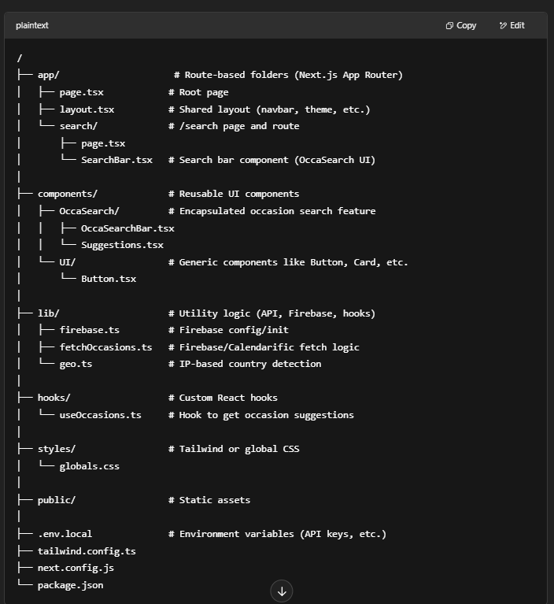

# OccaSearch

# Step 1: On load of home page: Get the country code from https://ipapi.co/json/ to know country code.
# step 2: Look for the event sin firebase after country code exist in firebase country list
    # Step 2.a: If country code doesn't exist then update the firebase with the code
    # Step 2.b: Get the public holidays of that country code and store the list 
# Step 3: get the holidays list skim the list and for today's date and Before 15 days popup the events related products below search bar.
# Step 4: Get the products lists from supabase/azure with those tags  related to events.
# Step 5: If products exist then display it under the bar. If not then don't show it  up

Firebase : 

1. /countries/master
{
  "IN": { "year": 2025, "last_updated": "..." },
  "US": { "year": 2025, "last_updated": "..." },
  ...
}

2. /events/{code} _{year}
{
  "country": "IN",
  "year": 2025,
  "events": [
    {
      "name": "Mother's Day",
      "date": "2025-05-12",
      "description": "Celebrate moms",
    },
    ...
  ],
  "last_synced": "2025-04-23"
}

